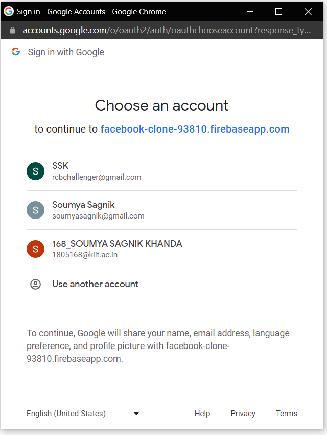

# Facebook Clone

<a href="https://facebook-clone-93810.web.app/">Visit</a>

Tech Stack: `React` `Context API` `Firebase 9` `Material UI`
 
Features: `Real Time DB` `Google Authentication` `Mobile Responsive` `Add Posts with images`

---

# Description

## Login Screen

## Google Authentication

## Main Page

## Mobile Responsive

---

## Dependencies

- npm install @mui/icons-material @mui/material @emotion/styled @emotion/react

- npm i firebase

---

## StateProvider.jsx

- `createContext()` creates a new context object, which can be used to pass data down the component tree without having to pass props manually at every level.

- `export const StateContext = createContext();` creates a new context object called StateContext and exports it. This context object will be used to store the global state.

- `export const StateProvider = ({ reducer, initialState, children }) => ...` creates a new component called `StateProvider`. This component takes three props: `reducer`, `initialState`, and `children`.

- The `StateProvider` component renders a `StateContext.Provider` component with a `value` prop set to the result of calling `useReducer` with the `reducer` and `initialState` props. `useReducer` is a hook that returns an array with two values: the current state and a dispatch function to update the state. By setting the `value` prop to the result of `useReducer`, the `StateProvider` component provides the global state to any component that consumes the `StateContext`.

- `export const useStateValue = () => useContext(StateContext);` creates a custom hook called `useStateValue`. This hook uses the `useContext` hook to consume the `StateContext` and returns the current state and dispatch function. Any component that needs to access the global state can use the `useStateValue` hook to consume the `StateContext`.

---

## Deploy

- npm install -g firebase-tools

- firebase login

- firebase init hosting

- public directory - build/ dist (CRA/ Vite)

- npm run build

- firebase deploy --only hosting
